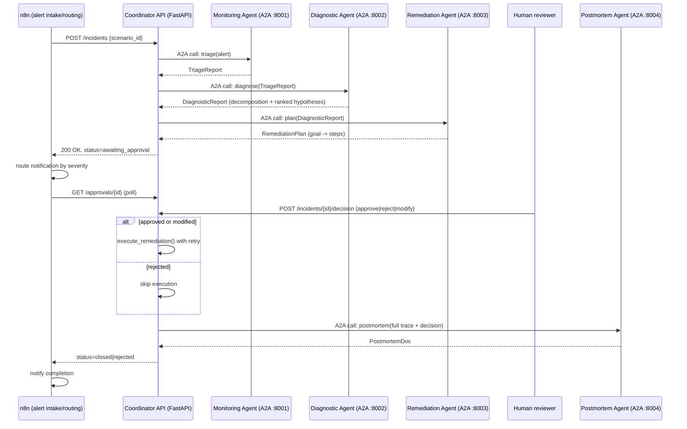
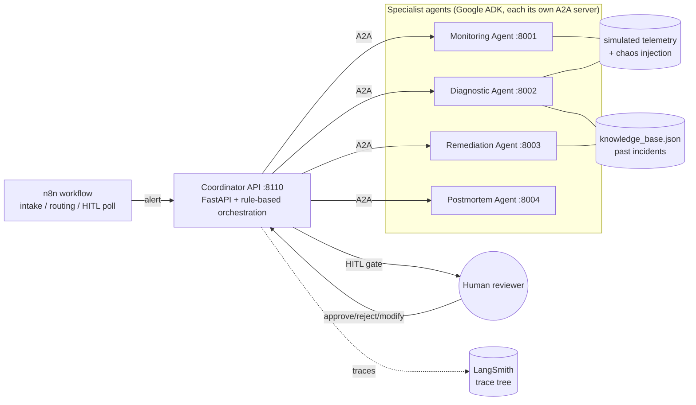

# Architecture — Multi-Agent Incident Response System

**Track 2: Multi-Agent Incident Response System**
Frameworks used: **Google ADK**, **A2A Protocol**, **n8n**, **LangSmith** (4 of the 5 listed; 2 required).

---

## 1. Overview

A simulated production incident (elevated errors/latency, a failing dependency, an
expired certificate, ...) comes in as an alert. Four specialist agents — each an
independent **Google ADK** `LlmAgent` running as its own **A2A** server process —
collaborate under a rule-based **Coordinator** to triage the incident, decompose
and rank root-cause hypotheses against a knowledge base of past incidents, plan a
risk-ranked remediation, stop for **human approval**, execute the approved plan
against simulated infrastructure, and write a post-mortem. **n8n** fronts the
system for alert intake and routing; **LangSmith** traces every reasoning stage.

## 2. Agent roles

| Agent | Role | Input | Output | Tools |
|---|---|---|---|---|
| **Monitoring** | Triage: pull live telemetry, flag anomalies, report honestly on data gaps | raw alert (service, description) | `TriageReport` | `get_metrics_snapshot`, `get_recent_logs` |
| **Diagnostic** | Root-cause analysis via explicit sub-question decomposition + KB search | `TriageReport` | `DiagnosticReport` (ranked hypotheses) | `get_recent_logs`, `search_knowledge_base` |
| **Remediation** | Turn the leading diagnosis into a hierarchical, risk-ranked action plan | `DiagnosticReport` | `RemediationPlan` (goal → ordered steps) | `list_remediation_catalog` |
| **Postmortem** | Synthesize the full trace, including the human decision, into a report | full incident trace | `PostmortemDoc` | — |
| **Coordinator** | Orchestration: A2A handoffs, the HITL gate, retries/fallback, execution | all of the above | `IncidentState` | direct call to `simulate_execute_action` |

Each specialist has one job and one output contract (a Pydantic schema in
`schemas.py`) — no overlap. The Coordinator does *not* diagnose or plan; it only
sequences calls, decides what to do with a human decision, and executes the
already-approved steps. This keeps "who decided what" traceable to a single agent
per decision, which matters for the post-mortem's audit trail.

## 3. Framework selection & tradeoffs

**Google ADK** — every specialist is an ADK `LlmAgent` with `output_schema` (a
Pydantic model) and `tools` (plain Python functions ADK auto-wraps). This gives
structured, type-checked hand-offs between agents "for free," and ADK's
`on_model_error_callback`/`on_tool_error_callback` hooks are what make graceful
degradation possible without hand-rolled retry plumbing (§6). *Tradeoff*: ADK's
A2A support is explicitly marked experimental (v2.5) — acceptable for a course
project, but a production system would pin versions carefully and watch for
breaking changes.

**A2A Protocol** — each specialist is exposed via ADK's `to_a2a()` as a standalone
Starlette app (real HTTP + JSON-RPC, its own port, its own `/.well-known/agent-card.json`),
and the Coordinator talks to it through `RemoteA2aAgent`. This is genuine
inter-process agent communication, not an in-process function call dressed up as
"multi-agent" — you can `curl` an agent's card, and a *different* client (e.g.
another team's system) could call these agents too. *Tradeoff*: four extra
processes to manage vs. one in-process multi-agent app; chosen deliberately
because Track 2 calls out "designing agent communication protocols," which
requires the protocol boundary to be real.

**n8n** — fronts the system for alert intake/routing (`n8n/incident_response_workflow.json`):
a webhook receives the alert, an HTTP node starts the incident (triage → diagnosis
→ plan), a routing step picks a notification channel by severity, and a poll loop
waits for the human decision before sending a completion notification. *Tradeoff*:
n8n adds an extra moving part for a demo; justified because "alerting/routing" is
explicitly the Track 2 technical emphasis, and it cleanly separates *notification
routing* (n8n's job) from *reasoning* (the agents' job) — the coordinator API
works identically with or without n8n in front of it (see `run_incident.py`,
which posts directly to the coordinator if no n8n webhook is configured).

**LangSmith** — every coordinator stage (`triage_stage`, `diagnosis_stage`,
`remediation_planning_stage`, `execute_remediation_stage`, `postmortem_stage`) is
wrapped in `@traceable`, tagged with `incident:<id>`, forming one nested run tree
per incident from alert to post-mortem — including which branch (approve/reject/
modify) the human took and which calls fell back to degraded mode. *Tradeoff*:
`@traceable` is a no-op without an API key, so tracing is additive, not a hard
dependency — the system runs (and this was relied on for local testing in this
sandbox, which had no LangSmith/Gemini credentials) even when nothing is
configured, it just isn't remotely observable. A second, local complement to
LangSmith needs no API key at all: the coordinator serves a live HTML view
(`GET /dashboard`, `GET /incidents/{id}/report`, see `api/report.py`) that
renders every agent's actual structured output -- the diagnostic
decomposition and ranked hypotheses with cited evidence, the remediation
goal/step plan, the HITL decision, execution results, the postmortem -- and
auto-refreshes while the incident is still in flight, since it reads the same
mutable `IncidentState` object the coordinator is actively updating. The
dashboard lists every incident the coordinator has ever handled (it reloads
`runs/*.json` on startup, so history survives restarts), and the HITL
checkpoint itself is submittable from the report page's own form -- not just
from a curl call or the CLI's terminal prompt -- since an incident filed
through n8n or curl has no terminal to prompt in the first place.

**Why not CrewAI or LangGraph too?** Two frameworks were required; four were used
because each targets a different concern (agent runtime, wire protocol, external
routing, observability) rather than duplicating one. Adding CrewAI or LangGraph
on top would mean two competing agent-orchestration layers for no added
capability — see §7 for why the Coordinator is deliberately *not* a LangGraph
graph.

## 4. Data flow

## 5. Planning & reasoning: hierarchical decomposition, not a single call

The Diagnostic Agent is required (by its `instruction`, enforced structurally by
`output_schema=DiagnosticReport`) to first emit an explicit `decomposition`
(2–4 sub-questions, e.g. *"did this correlate with a recent deploy?"*, *"does this
match a known pattern?"*) with a `finding` for each, **before** it is allowed to
rank hypotheses. Each hypothesis must cite supporting *and* contradicting
evidence and a confidence score — the model cannot just assert an answer. The
Remediation Agent similarly must organize its output into two goals
("Immediate mitigation" vs. "Preventive follow-up"), each an ordered list of
steps with risk and rollback — a goal hierarchy, not a flat action list. This
decomposition is produced by the model at request time (it is not a hard-coded
if/else over incident types), so it is genuinely inspectable per-incident in the
LangSmith trace and in the saved `runs/<incident_id>.json` record — a different
incident can and does produce a different decomposition.

## 6. Adaptability: two independent layers of resilience

1. **LLM unavailable, agent process fine** — every agent's `on_model_error_callback`
   catches the model-call failure and calls the *same tools* the LLM would have
   called, applying a deterministic rule (metric-over-threshold, keyword-overlap
   KB/catalog search) to produce a schema-valid, `degraded_mode=True` result. This
   is what actually ran throughout local development in this sandbox (no Gemini
   key configured) — see the "degraded mode" markers in the CLI demo output.
2. **Agent process unreachable** — the Coordinator's `_call_with_resilience`
   retries the A2A call once, then falls back to calling the *same* deterministic
   heuristic function directly, in-process (imported from the agent module) —
   e.g. if the diagnostic-agent server crashed, the coordinator still produces a
   `DiagnosticReport` instead of aborting the incident. Every fallback is recorded
   in `coordinator_notes` so it's visible in the final record, not silently hidden.

Independently, the simulated telemetry/execution layer (`data/telemetry.py`)
injects deterministic transient failures per scenario (a log API timing out once,
a metrics API failing once, a remediation action failing once) so every demo run
exercises tool-level retry (`execute_remediation` retries each step 3x with
backoff before marking it failed) without relying on real infrastructure flakiness.

## 7. Coordination model: why a rule-based Coordinator, not an LLM router

ADK supports LLM-driven delegation (an `LlmAgent` with `sub_agents` that decides
at runtime which to transfer to). This system deliberately does **not** use that
for top-level orchestration. Two reasons:

- **HITL has to be a hard stop.** The plan must be produced, and *nothing else
  may happen* until a human calls `POST /incidents/{id}/decision`. An LLM router
  choosing when to "hand off to execution" is a soft, model-dependent boundary;
  explicit code (`run_to_approval` returns; `resume_after_decision` is a separate,
  human-triggered call) is a hard one. This is the single most important design
  decision in the system given the rubric's "HITL checkpoints are meaningful...
  not rubber-stamp confirmations" requirement.
- **Partial information has to be handled uniformly.** Track 2 calls out
  "handling partial information" explicitly. Centralizing retry/fallback policy
  in one place (`_call_with_resilience`) makes that policy inspectable and
  testable (`tests/test_coordinator_resilience.py`) in a way that's harder to
  guarantee if the decision to retry/fall back is itself made by a fifth LLM call
  that could also fail.

**Alternative considered: LangGraph with a HITL interrupt.** LangGraph's
`interrupt()` primitive is arguably a more idiomatic way to express "pause a
graph until a human resumes it," and was seriously considered. It was rejected
for this project because it would have meant running a second, competing
orchestration runtime alongside ADK/A2A for no functional gain here — the
FastAPI status-machine (`IncidentState.status`) gives the same pause/resume
semantics while keeping the Coordinator a single, plain, testable Python module.
A LangGraph-based coordinator is the natural "if we had more time" alternative
(see §9).

## 8. Human-in-the-loop

The gate sits between `run_to_approval` (triage → diagnosis → plan) and
`resume_after_decision` (execute → post-mortem). It is not a rubber stamp:

- **Approve** runs the plan's `ranked_recommendation` goal.
- **Reject** runs *no* remediation at all — the post-mortem is still generated
  and explicitly records "none -- human rejected" plus the reviewer's reason.
- **Modify** lets the human pick a *different* goal than the one the agent
  recommended (e.g. run "Preventive follow-up" instead of "Immediate mitigation");
  `_select_goal` executes exactly the human's choice. Verified in
  `tests/test_coordinator_resilience.py::test_select_goal_modify_switches_to_requested_goal`
  and end-to-end via the CLI demo.

## 9. Limitations & future work

- **Fallback ranking quality.** The degraded-mode diagnostic fallback ranks past
  incidents by keyword overlap, not causal reasoning — on the `auth-cert-expiry`
  demo scenario it sometimes ties two unrelated past incidents and picks the
  wrong one as "leading" when the LLM is unavailable. This is an honest
  limitation of the fallback (by design, cheaper and dumber than the LLM path,
  not disguised as equally good) rather than a bug; a real deployment would use
  embedding-based retrieval for the fallback path too.
- **Chaos budget is per-process, not per-incident.** `data/telemetry.py` fails a
  tool's *first* call for a given service for the lifetime of that agent's
  process, then stops failing. Fine for a demo (each run starts fresh servers);
  a long-running deployment would need per-incident fault injection instead.
- **In-memory incident store.** The Coordinator API keeps `IncidentState` in a
  process-local dict (plus a JSON snapshot per incident under `runs/`) — restarting
  the coordinator loses in-flight incidents. A real system would persist to a
  database and make the A2A calls resumable.
- **Single approver, no auth.** `ApprovalDecision.reviewer` is a free-text field;
  there's no identity/authorization on who is allowed to approve a given
  incident's remediation. Would need real auth before this touched real
  infrastructure.
- **Next steps:** swap the in-memory store for Postgres; add an
  embeddings-backed knowledge base so the *fallback* path degrades more gracefully;
  add a LangGraph-based alternative coordinator behind the same API for direct
  comparison; wire n8n's Slack/PagerDuty nodes for real notification delivery
  instead of the mock `/notify` sink.
